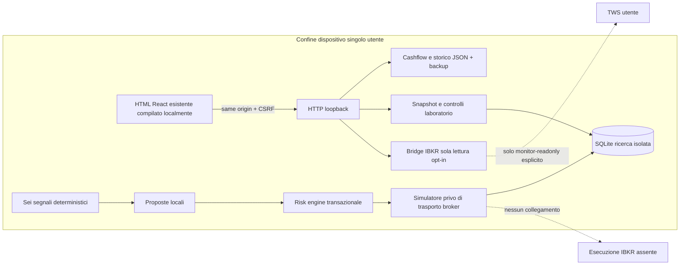
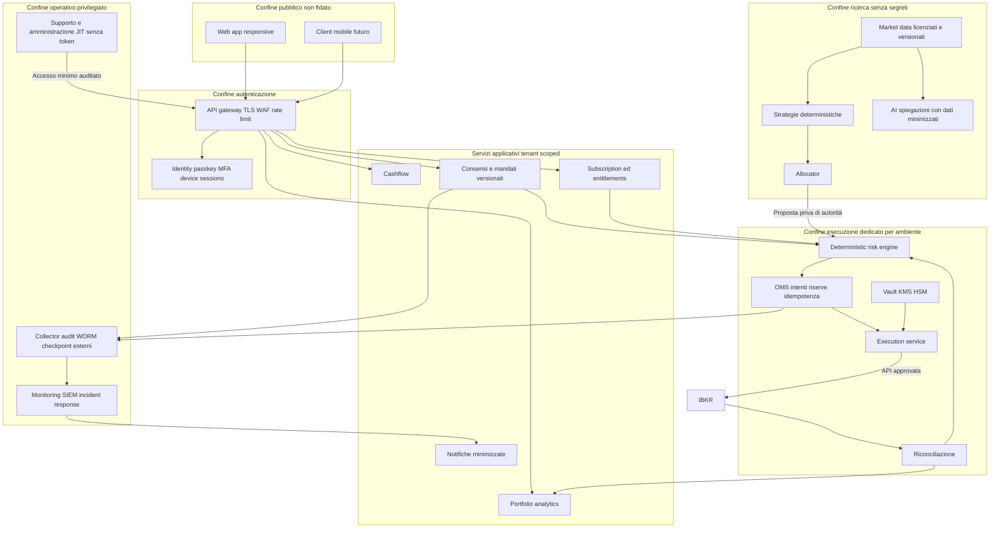

# Architettura, sicurezza e recovery — 10 settembre 2026

Stato: baseline locale di ricerca implementata; architettura B2C seguente è target, non servizio distribuito. Assunzione approvabile: primo prodotto commerciale A/B (budget e lettura), C/D bloccati. Nessuna nuova custodia di fondi. Il processo AI non è un principal autorizzato all'esecuzione.

## Evoluzione dal repository attuale

Il frontend sorgente rimane lo stesso file, compilato in `web-build` per non cambiare inutilmente le formule. Le risorse React sono locali e versionate; Babel è solo compilatore build, non eseguito nella pagina servita. `local_security.py` protegge Host/Origin, richieste mutative con token e limiti payload. `research` non importa ibapi, socket o client HTTP. JSON cashflow non viene migrato automaticamente nel ledger di ricerca. SQLite contiene esclusivamente capitale sintetico in USD, ordini simulati e audit. Stato finanziario personale e profitti sintetici non sono sommati.

Il laboratorio non ha un endpoint di invio ordini o attivazione live. Gli script di ricerca chiamano il risk engine locale. L'oggetto SDK del vecchio monitor blocca esplicitamente `placeOrder`, `cancelOrder`, `reqGlobalCancel`. Il monitor è una capacità di lettura separata, non l'adattatore di esecuzione paper futuro. Nessuna porta paper prova da sola l'identità del conto.

## Target B2C

Mantenere inizialmente monolite modulare applicativo e processi separati per esecuzione/market data; non moltiplicare microservizi prima di misurare scala. Cashflow e analytics condividono modelli espliciti e versionati; il rischio non dipende dalla disponibilità dell'AI. Gateway non è autorizzazione finale: tenant e account verificati in ogni query e comando. PostgreSQL + RLS, identità del tenant derivata da sessione verificata, test cross-tenant, policy default-deny. Supporto non può inviare ordini, cambiare limiti o impersonare liberamente utenti. Entitlement concede funzionalità, mai bypass del rischio o promessa di performance.

## Flusso ordine target e gestione stato incerto

1. Dati con source ID, timestamp exchange/ingest, sequenza, timezone UTC, valuta e qualità.
2. Strategia versionata legge solo finestre chiuse; produce intent non eseguibile, hash versione/dataset.
3. Allocator propone budget entro account, concentrazione, correlazioni e profilo. Riduce/esclude, non crea leva.
4. Risk engine verifica account/mandato/entitlement/versione/gate, quotazioni, posizioni e tutte riserve pendenti in transazione serializzabile.
5. OMS persiste intent + decisione + audit + outbox atomicamente. Execution riceve solo decisioni firmate e a breve TTL vincolate a parametri/account/ambiente. Firma non disponibile al modello né al frontend.
6. Prima dell'invio ricontrolla freschezza/limiti e idempotenza. `execId`, `permId`, `orderId/clientId`, account e conId distinti; eventi deduplicati, commissioni possono arrivare dopo fill.
7. Timeout di invio => stato UNKNOWN e blocco, interrogare broker; mai ritentare alla cieca con nuovo identificativo.
8. Partial fill aggiorna posizioni, costo, cash e riserve residue; cancellazione non equivale a conferma di cancellazione. Eventi ordine/fill concorrenti serializzati.
9. Avvio/reconnect esige riconciliazione ordini, esecuzioni, saldi e posizioni. Se manca una prova, niente nuove entrate.

Pausa impedisce nuovi intenti ma non cancella ordini; annulla pendenti è un comando diverso; chiudi posizioni richiede conferma distinta con stima costi/slippage, possibili perdite ed effetti fiscali. Arresto d'emergenza blocca nuove capacità di esecuzione; non promette annullamento di ordini già sul broker durante outage. Il laboratorio non offre liquidazione UI.

## Ambienti e isolamento

| Ambiente | Dati | Credenziali/rete | Gate |
|---|---|---|---|
| Development | sintetici locali | simulatore senza trasporto; no broker di default | test unitari/build |
| Test | directory temporanee e fixture | fake SDK che non apre socket; nessuna credenziale | fault injection, API, contabilità |
| Staging | dati anonimizzati/sintetici | account cloud/KMS/DB separati, no segreti produzione | QA, IAM, pen test |
| Ricerca simulata implementata | libro USD sintetico | modulo Python non importa API rete/IBKR | nessun rendimento dichiarato |
| Paper IBKR futuro | account paper attestato | processo/VM separata, firewall allowlist SOLO gateway paper, segreti paper separati; niente routing/credenziali live | evidenze OOS + approvazione + verifica account lato broker |
| Live futuro | dati reali minimizzati | altro account infrastrutturale, KMS/vault/VPC e ruoli separati; non provisionato qui | iter legale/contrattuale, approvazione separata, capitale ridotto |

Un flag o porta 7497 non costituisce isolamento. Nel repository non è implementato un servizio di esecuzione IBKR paper: resta bloccato anziché collegare un ambiente ambiguo. Il simulatore è tecnicamente senza endpoint broker; Python sul dispositivo non è una sandbox contro un amministratore che riscrive il codice. L'isolamento di rete attestato richiede una piattaforma di deployment scelta; non è stato simulato con una configurazione inerte.

## Threat model

| Minaccia | Asset/confine | Controllo presente | Residuo / requisito produzione |
|---|---|---|---|
| Sito ostile legge cashflow su localhost | web→HTTP | Origin esatta, Host allowlist anti rebinding, Sec-Fetch-Site, nessun CORS wildcard | Processo locale dell'utente può leggere; IAM locale autenticato/IPC per utenti non fidati |
| CSRF modifica o cancella dati | web→POST | JSON obbligatorio, token casuale per processo non in URL, confronto costante; beacon con token nel body | XSS same-origin può usare token; CSP e dipendenze verificate |
| XSS/supply chain CDN | browser e dati | React escaping, script solo self, nessun eval nella pagina servita, asset pinned/hash | Revisione componenti/import; aggiornamenti dipendenze e SAST continuo |
| Denial of service locale | HTTP/DB | payload max10MB, profondità24, campi/liste limitati, rate600/min, timeout body5s | HTTP stdlib non production server, manca limite connessioni e WAF; loopback soltanto |
| Corruzione/sovrascrittura memoria | JSON | fsync+rename, backup precedente, 0600, stop salvataggi su load fallito | Nessuna cifratura applicativa, backup unico non disaster recovery, conflitti multiwindow da affrontare |
| Modifica audit/ledger | SQLite | transazioni, hash chain + digest ledger, trigger anti UPDATE/DELETE, stop su mismatch | Admin può cancellare tutto o ricostruire catena: external signed checkpoint/WORM necessario |
| Doppio ordine o fill | OMS locale | chiave idempotenza persistente, transazione, quota condivisa, dedup quote e riserve | Connettore broker/outbox distribuito da implementare |
| Dati stale o outage | strategy/risk | fail closed, età quote, timestamp futuri, riconciliazione richiesta al riavvio | Mark-to-market multiasset robusto/feed sequence recovery futuro |
| AI compromessa/prompt injection | AI→execution | nessun canale AI→broker; proposte passano rischio, nessun live adapter | Isolamento workload e permessi KMS indipendenti richiesti in cloud |
| Cross-tenant/IDOR | utente→dati | laboratorio rappresenta solo tenant fisso local-research, rifiuta account diversi | Non è tenant isolation B2C; RLS+IAM e test indipendenti prima di beta |
| Furto dispositivo | filesystem/sessioni | permessi file, nessuna password broker nell'app | Keychain/Keystore, cifratura dati e backup, screen lock e device revocation |
| Admin infedele | controllo produzione | nessuna infrastruttura live creata | separazione ruoli, JIT, doppio controllo per limiti, log su account separato |

## Credenziali e sessioni target

Matrice dettagliata in IBKR_COMPLIANCE.md. OAuth ufficialmente approvato prima di token vendor; mai password broker. Passkey WebAuthn con challenge monouso server, verifica RP ID/origin e user verification; MFA step-up per mandato/nuovo dispositivo/cambio limiti. Biometria solo locale Secure Enclave/Keystore, non dati biometrici sul server. Recupero account con controlli indipendenti, revoca globale sessioni e periodo di raffreddamento sulle capacità sensibili; niente recupero via sole domande personali. Session ID opaco cookie HttpOnly Secure SameSite, refresh rotation e revoca; nessun token in localStorage. Device binding con chiave per dispositivo, revocabile, compatibile col recupero/accessibilità.

TLS 1.2/1.3 configurato su deployment verificato; mTLS/identità workload fra servizi sensibili. Nel locale attuale HTTP loopback non è TLS, e non va pubblicato in rete. DEK per tenant crittografata da KEK KMS, least privilege, cifratura autenticata da libreria mantenuta, nonce e metadata versionati. Nessuna implementazione crittografica artigianale in questo incremento. Token decifrato soltanto nel connector dedicato per il tempo della chiamata/sessione necessaria; Python non garantisce zeroizzazione perfetta. Uso HSM per firma evita esportazione chiave ove protocollo supporti. Rotazione/revoca rispettano provider TTL, allerta anomalie, audit indipendente.

DB compromesso non deve consentire decifratura senza KMS; dispositivo compromesso può usare sessione e dati già decifrati: revocare broker/device, bloccare execution, ripristinare host affidabile. Admin cloud+KMS compromesso resta rischio grave: separare organizzazioni/ruoli, doppio controllo e alert esterni. Backup cifrati con chiavi distinte e restore drill, non copia di segreti attivi in archivi esportati.

## Operatività e recovery target

- SLO iniziali da negoziare: UI informativa 99,5% mensile; esecuzione non abilitata fino a misura di feed/latency e servizio on-call adeguato. BTC 24/7 implica copertura notturna/weekend e manutenzioni venue, non promessa di continuità.
- Obiettivi proposti prima della beta: RPO cashflow ≤24h e RTO ≤8h; per OMS RPO log ordini=0 rispetto a transazioni committed e recovery prima di operare subordinato alla riconciliazione, non a timer. Non sono garanzie raggiunte.
- Backup: cifrato/versionato su failure domain separato, restore trimestrale su ambiente isolato; verificare checksum, schema, audit checkpoint, saldo e conteggi prima di riaprire.
- Metriche: freshness e heartbeat reali, errori/reject, code/pacing, quote gaps, latenza p50/p95/p99, drift posizioni/cash, blocchi rischio, disk space, audit lag. Mai account ID/token nei label metrici.
- Incidente: identificare severità/owner, sospendere nuovi ordini, preservare prove, revocare capacità compromesse, riconciliare sul broker, notifiche minimizzate, triage legale GDPR/settoriale, postmortem e prova recovery.
- SIEM con log strutturati redatti; incident register e checklist breach. Disclosure privata con contatto verificato prima del lancio; non pubblicare un indirizzo fittizio.
- ASVS e MASVS sono standard target di verifica, non certificazioni ottenute. SAST/dependency/secret scans e test sono prerequisiti, non sostituiscono pentest indipendente. Mobile client da implementare dopo contratto API/IAM stabili; niente WebView con token broker.
